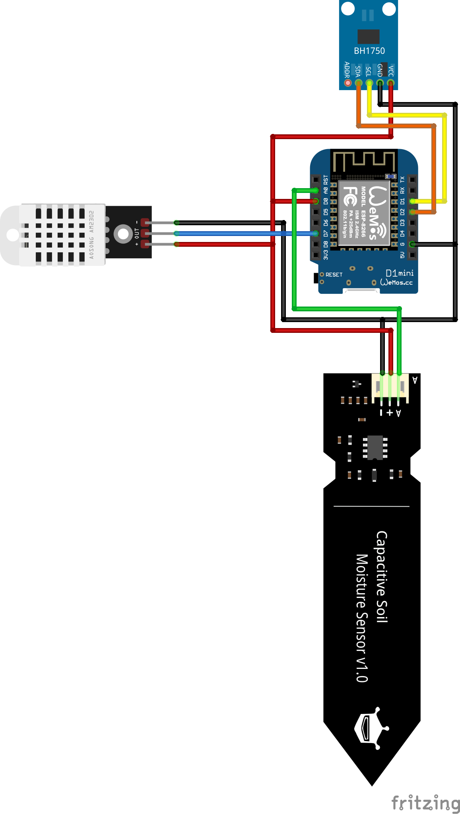

# Planz - Sensors

## Hardware

In the table, you can see the parts we used to build the plant monitoring system. If you want to use a different version
of the ESP, you will need to build your own firmware.

| Sensor                          | Part-name                       | Link                                                                                                                                                                                                                                                                                                                                                                                                                                                                                                                                                                                                                                                                                           |
|---------------------------------|---------------------------------|------------------------------------------------------------------------------------------------------------------------------------------------------------------------------------------------------------------------------------------------------------------------------------------------------------------------------------------------------------------------------------------------------------------------------------------------------------------------------------------------------------------------------------------------------------------------------------------------------------------------------------------------------------------------------------------------|
| Humidity and temperature sensor | DHT 22                          | [Link to aliexpress](https://de.aliexpress.com/item/1005005585666484.html?spm=a2g0o.productlist.main.47.294d22a3jdvsvV&aem_p4p_detail=202504130231312261253410908180003030379&algo_pvid=bf21d2fc-2831-4f39-b97e-5915f115c3ee&algo_exp_id=bf21d2fc-2831-4f39-b97e-5915f115c3ee-23&pdp_ext_f=%7B%22order%22%3A%221434%22%2C%22eval%22%3A%221%22%7D&pdp_npi=4%40dis%21CHF%216.12%216.12%21%21%217.32%217.32%21%40211b619a17445366915287291ebb77%2112000033650096214%21sea%21CH%214818084810%21X&curPageLogUid=CGz57ZeayL9L&utparam-url=scene%3Asearch%7Cquery_from%3A&search_p4p_id=202504130231312261253410908180003030379_6)                                                                    |
| Light Sensor                    | GY-302 BH1750                   | [Link to aliexpress](https://de.aliexpress.com/item/1005006794832418.html?src=google&pdp_npi=4%40dis!CHF!1.32!1.32!!!!!%40!12000038326580676!ppc!!!&src=google&albch=shopping&acnt=897-548-8760&isdl=y&slnk=&plac=&mtctp=&albbt=Google_7_shopping&aff_platform=google&aff_short_key=UneMJZVf&gclsrc=aw.ds&albagn=888888&ds_e_adid=&ds_e_matchtype=&ds_e_device=c&ds_e_network=x&ds_e_product_group_id=&ds_e_product_id=de1005006794832418&ds_e_product_merchant_id=524519870&ds_e_product_country=CH&ds_e_product_language=de&ds_e_product_channel=online&ds_e_product_store_id=&ds_url_v=2&albcp=19366796367&albag=&isSmbAutoCall=false&needSmbHouyi=false&gad_source=1&gatewayAdapt=glo2deu) |
| Soil moisture sensor            | Capacitive soil moisture sensor | [Link to aliexpress](https://de.aliexpress.com/item/1005005962452779.html?spm=a2g0o.productlist.main.3.663f2b2drVTqeF&algo_pvid=1b163adc-8f79-45e3-9abf-67c4075c4214&algo_exp_id=1b163adc-8f79-45e3-9abf-67c4075c4214-1&pdp_npi=4%40dis!CHF!1.71!1.11!!!13.81!8.97!%40211b619a17300259442758696eaa5a!12000035065313881!sea!CH!4802224370!X&curPageLogUid=GOGXM5hJj9UN&utparam-url=scene%3Asearch%7Cquery_from%3A)                                                                                                                                                                                                                                                                              |
| Microcontroller                 | D1 Mini ESP8266 (Type C)        | [Link to aliexpress](https://de.aliexpress.com/item/1005007877904928.html?spm=a2g0o.productlist.main.1.4687lvpOlvpOhF&algo_pvid=dbe81d6d-6853-4973-b6db-1dbd3df50cfb&algo_exp_id=dbe81d6d-6853-4973-b6db-1dbd3df50cfb-0&pdp_ext_f=%7B%22order%22%3A%223517%22%2C%22eval%22%3A%221%22%7D&pdp_npi=4%40dis%21CHF%212.12%212.12%21%21%212.53%212.53%21%40211b6c1917445360691631242e3cff%2112000042669746256%21sea%21CH%214818084810%21X&curPageLogUid=rYSx8bM5LtGF&utparam-url=scene%3Asearch%7Cquery_from%3A)                                                                                                                                                                                     |

## 3D-Printer Settings

We've supplied the STL files for the sensor case. You can find them in the [here](./stls).

Most probably you'll be able to use your own settings, but here are the ones we used to print the case.

| Parameters        | Values      |
|-------------------|-------------|
| Layer height      | 0.2         |
| Walls             | 3           |
| Top/Bottom Layers | 4           |
| Infill            | Cross Hatch |
| Supports          | None        |
| Method            | FDM         |

## How to build?

The connections from the sensors to the D1 Mini were made as shown in the diagram below.
If you want to use the prebuilt firmware, you should connect the sensors as shown in the diagram.
If you want to use a different ESP, you will need to build your own firmware.



## Flash on D1 Mini ESP88266

If you use the D1 Mini ESP8266, you can flash our firmware using the following steps:

1. Install python
   esptool [MicroPython Tutorial with ESP8266](https://docs.micropython.org/en/latest/esp8266/tutorial/intro.html)
2. Download `firmware.bin` from the [release page](https://github.com/OG-Jons/planz/releases)
3. Connect D1 Mini to PC with a USB-A to USB-C Cable
4. Flash D1 Mini with the following commands

```bash
python -m esptool erase_flash
python -m esptool --baud 1000000 write_flash --flash_size=4MB -fm dio 0 firmware.bin
```

5. Once completed, an Access Point called "PlantSensorSetup" will be created. Connect to this.
6. Open up "http://192.168.4.1" in your browser.
7. Fill out the fields. You're required to enter the URL of your server and the credentials of your local wireless network.
   - If you want to initialize a new plant, enter the name and species of the plant.
   - If there's already a Plant in the Database that you can use, enter the ID of the Plant.
8. Submit the form.
9. The D1 Mini will now connect to your local network and send the data to the server.
10. Every minute, the D1 Mini will send the statistics to the server.
11. Congratulations! You have successfully set up planz!

### Calibration

The capacitive soil moisture sensor needs to be calibrated. You can do this by following these steps:
1. Hold the sensor in the air and wait for it to send the data to the server.
2. Note the value of the soil moisture sensor. This is the value for dry soil.
3. Put the sensor (only the capacitive soil sensor!) in a glass of water and wait for it to send the data to the server.
4. Note the value of the soil moisture sensor. This is the value for wet soil.
5. Open the settings page in the web application and enter the values for dry and wet soil on your plant.
6. Save the settings and repeat the procedure for other plants.
7. Congratulations! You have successfully calibrated the soil moisture sensor.