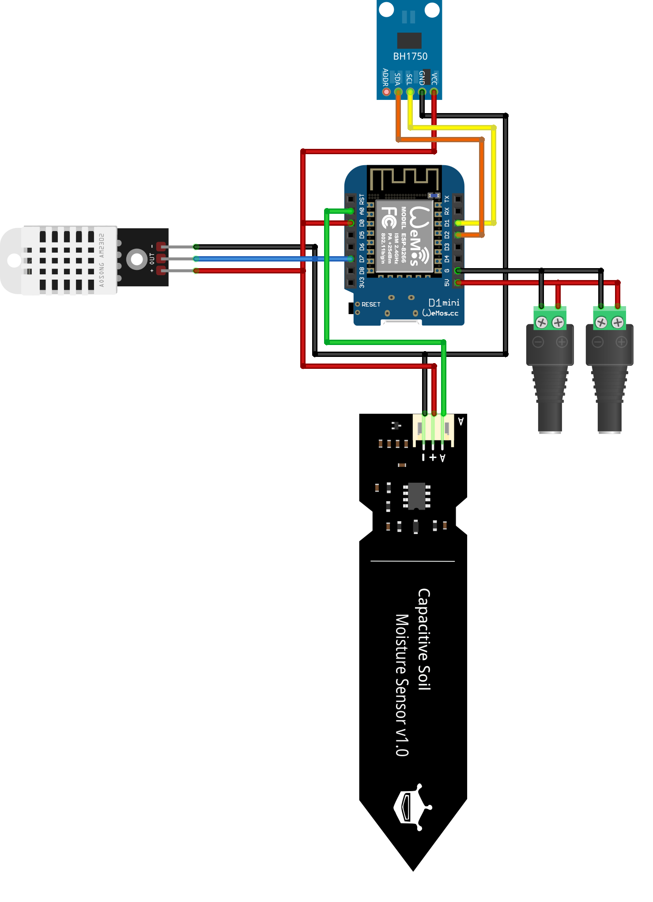

# Planz - Sensors

## Hardwareparts
In the table, you can see the parts we used to build the plant monitoring system. If you want to use a different version of the ESP, you will need to build your own firmware.
| Sensor-Typ                      | Sensor-Name                     | Link                                                                                                                                                                                                                                                                                                                                                                                                                                                                                                                                                                                                                                                                                           |
|---------------------------------|---------------------------------|------------------------------------------------------------------------------------------------------------------------------------------------------------------------------------------------------------------------------------------------------------------------------------------------------------------------------------------------------------------------------------------------------------------------------------------------------------------------------------------------------------------------------------------------------------------------------------------------------------------------------------------------------------------------------------------------|
| Humidity and temperature sensor | DHT 22                          | [Link to aliexpress](https://de.aliexpress.com/item/1005005585666484.html?spm=a2g0o.productlist.main.47.294d22a3jdvsvV&aem_p4p_detail=202504130231312261253410908180003030379&algo_pvid=bf21d2fc-2831-4f39-b97e-5915f115c3ee&algo_exp_id=bf21d2fc-2831-4f39-b97e-5915f115c3ee-23&pdp_ext_f=%7B%22order%22%3A%221434%22%2C%22eval%22%3A%221%22%7D&pdp_npi=4%40dis%21CHF%216.12%216.12%21%21%217.32%217.32%21%40211b619a17445366915287291ebb77%2112000033650096214%21sea%21CH%214818084810%21X&curPageLogUid=CGz57ZeayL9L&utparam-url=scene%3Asearch%7Cquery_from%3A&search_p4p_id=202504130231312261253410908180003030379_6)                                                                    |
| Light Sensor                    | GY-302 BH1750                   | [Link to aliexpress](https://de.aliexpress.com/item/1005006794832418.html?src=google&pdp_npi=4%40dis!CHF!1.32!1.32!!!!!%40!12000038326580676!ppc!!!&src=google&albch=shopping&acnt=897-548-8760&isdl=y&slnk=&plac=&mtctp=&albbt=Google_7_shopping&aff_platform=google&aff_short_key=UneMJZVf&gclsrc=aw.ds&albagn=888888&ds_e_adid=&ds_e_matchtype=&ds_e_device=c&ds_e_network=x&ds_e_product_group_id=&ds_e_product_id=de1005006794832418&ds_e_product_merchant_id=524519870&ds_e_product_country=CH&ds_e_product_language=de&ds_e_product_channel=online&ds_e_product_store_id=&ds_url_v=2&albcp=19366796367&albag=&isSmbAutoCall=false&needSmbHouyi=false&gad_source=1&gatewayAdapt=glo2deu) |
| Soil moisture sensor            | Capacitive soil moisture sensor | [Link to aliexpress](https://de.aliexpress.com/item/1005005962452779.html?spm=a2g0o.productlist.main.3.663f2b2drVTqeF&algo_pvid=1b163adc-8f79-45e3-9abf-67c4075c4214&algo_exp_id=1b163adc-8f79-45e3-9abf-67c4075c4214-1&pdp_npi=4%40dis!CHF!1.71!1.11!!!13.81!8.97!%40211b619a17300259442758696eaa5a!12000035065313881!sea!CH!4802224370!X&curPageLogUid=GOGXM5hJj9UN&utparam-url=scene%3Asearch%7Cquery_from%3A)                                                                                                                                                                                                                                                                              |
| Main Sensor-Platin              | D1 Mini ESP8266                         | [Link to aliexpress](https://de.aliexpress.com/item/1005007877904928.html?spm=a2g0o.productlist.main.1.4687lvpOlvpOhF&algo_pvid=dbe81d6d-6853-4973-b6db-1dbd3df50cfb&algo_exp_id=dbe81d6d-6853-4973-b6db-1dbd3df50cfb-0&pdp_ext_f=%7B%22order%22%3A%223517%22%2C%22eval%22%3A%221%22%7D&pdp_npi=4%40dis%21CHF%212.12%212.12%21%21%212.53%212.53%21%40211b6c1917445360691631242e3cff%2112000042669746256%21sea%21CH%214818084810%21X&curPageLogUid=rYSx8bM5LtGF&utparam-url=scene%3Asearch%7Cquery_from%3A)                                                                                                                                                                                     |
|                                 |                                 |                                                                                                                                                                                                                                                                                                                                                                                                                                                                                                                                                                                                                                                                                                |
|                                 |                                 |                                                                                                                                                                                                                                                                                                                                                                                                                                                                                                                                                                                                                                                                                                |


## 3D-Printer Settings
Printer-Settings we recommend
| Parameters        | Values      |
|-------------------|-------------|
| Layer height      | 0.2         |
|  Walls            | 3           |
| Top/Bottom Layers | 4           |
| Infill            | Cross Hatch |
| Supports          | -           |
| Method            | FDM         |

## How to build?
The connections from the sensors to the D1 Mini were made as shown in the diagram below.




## Flash on D1 Mini ESP88266
If you use the D1 Mini ESP8266, you can flash our firmware using the following steps:

1. Install python esptool [MicroPython Tutorial with ESP8266](https://docs.micropython.org/en/latest/esp8266/tutorial/intro.html)
2. Download firmware.bin realease from the [release page](https://github.com/OG-Jons/planz/releases)
3. Connect D1 Mini to PC with a USB-A to USB-C Cable
4. Flash D1 Mini with the folowing commands
```bash
python -m esptool erase_flash
python -m esptool --baud 1000000 write_flash --flash_size=4MB -fm dio 0 firmware.bin
```